+ ES6 이전 var 
+ ES6 이후 let, const
## var
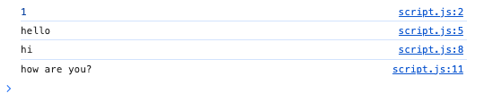

## let
### 중복 선언 불가
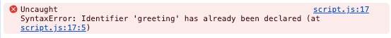 
### 재할당 가능
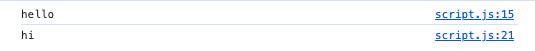

## Const
### 중복 선언 X
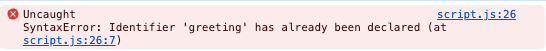
### 재할당 X
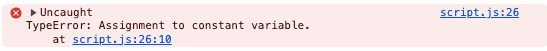

# Scope

## var
### func level
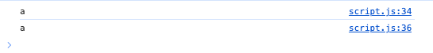
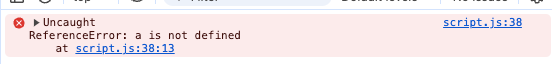

## let, const
### block level
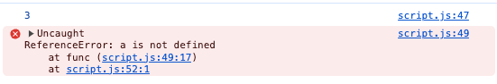

# hosting
## var
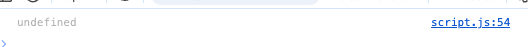

## let
### TDZ(Temporal Dead Zone) 발생
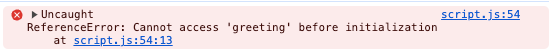

## func
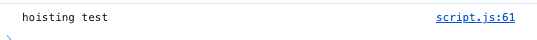