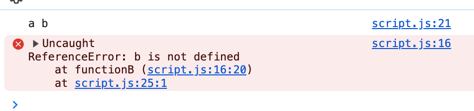

# Closure 사용 X
```
let a = 'a';

function functionB(){
    let c = 'c';
    console.log(a, b, c);
}

functionB();

function functionA(){
    let b = 'b';
    console.log(a, b);
}

functionA();
```

# Closure 사용
```
let a = 'a';

function functionA(){
    let b = 'b';
    function functionB(){
        let c = 'c';
        console.log(a, b, c);
    }
    functionB();
    console.log(a, b);
}

functionA();
```