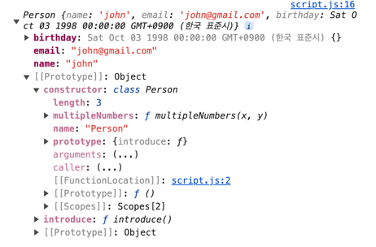

# ES6 Classes

+ class의 경우에는 자동으로 prototype에 `introduce()`이 등록된다.
+ class의 `constructor`에는 `class Person`이 자동으로 등록이 된다.
+ `static multipleNumbers()`의 경우에는 class의 `constructor`의 `class Person`에 자동으로 등록이 된다.

```javascript
class Person{
    constructor(name, email, birthday){
        this.name = name;
        this.email = email;
        this.birthday = new Date(birthday);
    }
    introduce() {
        return `Hello my name is ${this.name}`;
    }
    static multipleNumbers(x, y){
        return x * y;
    }
}

console.log(john.introduce())
console.log(Person.multipleNumbers(3, 4))
```
+ class의 메서드를 사용하려면 `john.introduce()`
+ class의 static을 사용하려면 `Person.multipleNumbers()`