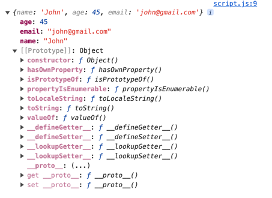
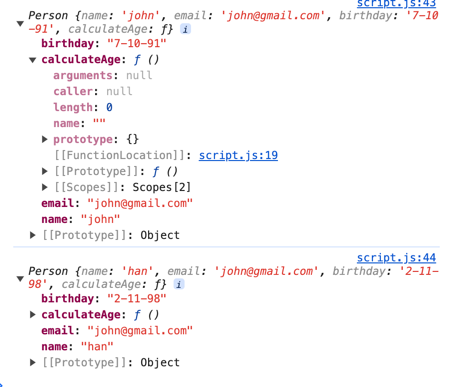
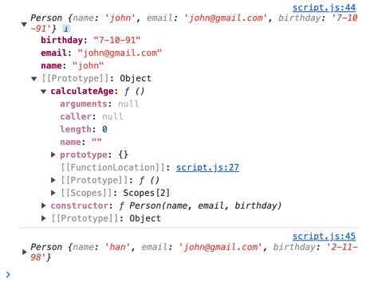
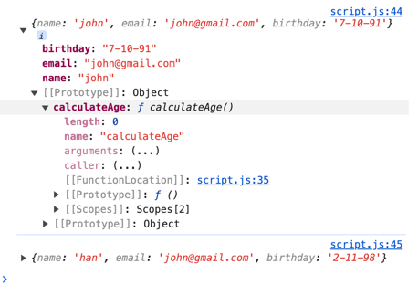

# Prototype
```javascript
let user = {
    name: "John",
    age: 45,
    email: "john@gmail.com",
};

console.log(user);
```


# 생성자 함수
```javascript
function Person(name, email, birthday) {
    this.name = name;
    this.email = email;
    this.birthday = birthday;
    this.calculateAge = function () {
        const diff = Date.new() - this.birthday.getTime();
        const ageDate = new Date(diff);
        return Math.abs(ageDate.getUTCFullYear() - 1970);
    }
}

const john = new Person('john', 'john@gmail.com', '7-10-91');
const han = new Person('han', 'john@gmail.com', '2-11-98');
console.log(john);
console.log(han);
```

+ return 없이 자동으로 객체의 인스턴스를 return한다.
+ prototype의 중복이 발생한다.

prototype chain을 통해서 calculateAge 메서드를 상속받아 사용하여 더 적은 메모리를 사용하고 코드를 재활용 할 수 있다.

# protyotpe에 직접 등록
```javascript
function Person(name, email, birthday){
    this.name = name;
    this.email = email;
    this.birthday = birthday;
}

Person.prototype.calculateAge = function (){

    const diff = Date.new() - this.birthday.getTime();
    const ageDate = new Date(diff);
    return Math.abs(ageDate.getUTCFullYear() - 1970);
}

const john = new Person('john', 'john@gmail.com', '7-10-91');
const han = new Person('han', 'john@gmail.com', '2-11-98');
console.log(john);
console.log(han);
```


# Object.create()
```javascript
function Person(name, email, birthday){
    const person = Object.create(personsPrototype);
    person.name = name;
    person.email = email;
    person.birthday = birthday;
    
    return person;
}

const personsPrototype = {
    calculateAge() {
        const diff = Date.new() - this.birthday.getTime();
        const ageDate = new Date(diff);
        return Math.abs(ageDate.getUTCFullYear() - 1970);
    }
}

const john = new Person('john', 'john@gmail.com', '7-10-91');
const han = new Person('han', 'john@gmail.com', '2-11-98');
console.log(john);
console.log(han);
```

+ `Object.create()`를 통하여 생성
+ return을 통하여 인스턴스 생성