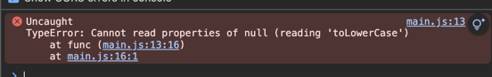

```typescript
// type assertion error
function func(arg: string | null){
    return (arg as string).toLowerCase();
}

func('hello');
func(null);
```


### 해결 방법
type guard`
```typescript
function func2(arg: string | null){
    if(arg){
        return arg.toLowerCase();
    }
}

func2('hello');
func2(null);
```