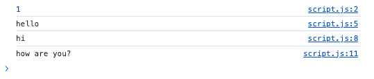
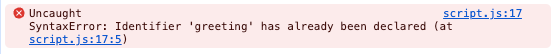
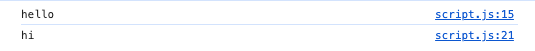
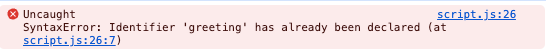
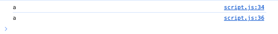
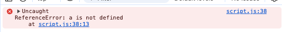
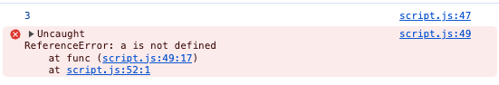
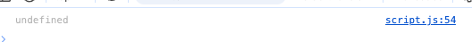
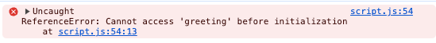
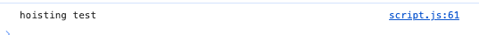

ES6 이전 var 
ES6 이후 let, const
## var

## let
중복 선언 불가 
 
재할당 가능 

## Const
중복 선언 X 
 
재할당 X 

# Scope

## var
func level 

## let, const
block level 

# hosting
## var

## let
TDZ(Temporal Dead Zone) 발생 

## func
